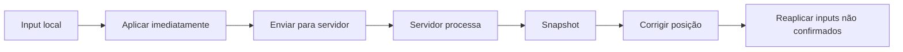

# Netcode BolaSocial

## Princípios

- **Servidor autoritativo**: o servidor mantém o estado verdadeiro da partida.
- **Tickrate 60 Hz**: física e lógica executam a cada 16,67 ms.
- **Snapshots 20 Hz**: estado comprimido enviado a cada 50 ms.
- **Inputs 60 Hz**: clientes transmitem intenções, nunca posições.

## Ciclo de Vida

1. Cliente captura teclado e gera `ClientInput` com `seq` incremental.
2. Input é enviado via SignalR para `MatchHub.Input`.
3. Servidor valida (rate limit, cooldowns, stamina) e enfileira para o jogador da partida.
4. `MatchLoop` processa inputs do tick corrente, avança física e gera snapshot.
5. Snapshot é emitido para todos os clientes; cada cliente atualiza estado local.
6. Cliente confirma `seq` aplicado, remove da fila de reconciliação e reaplica inputs pendentes.

## Previsão e Reconciliação



- **Buffer de Interpolação**: 100 ms (6 ticks). Jogadores remotos são renderizados com LERP.
- **Lag Compensation**: servidor armazena histórico curto para colisão bola x jogador.

## Estrutura do Snapshot

```json
{
  "tick": 9120,
  "ball": {"x":512.3,"y":256.1,"vx":-120,"vy":38},
  "players": [
    {"id":"p1","x":400.1,"y":280.0,"vx":90,"vy":0,"dir":90,"st":"idle","stamina":0.72,"hasBall":false}
  ],
  "score":{"home":1,"away":0},
  "time":{"elapsedMs":104000,"half":1},
  "events":[{"t":"pass","from":"p1","to":"p2"},{"t":"goal","by":"p3"}]
}
```

## Anti-cheat

- Janela de sequências aceita: `lastSeq` ± 120.
- Inputs rejeitados fora do tick atual.
- Cooldowns de passe/chute aplicados server-side.
- Nonce + assinatura HMAC leve por mensagem para mitigar replay.

## Testes

- **SimulationTests**: valida gols, escanteios, laterais e colisões.
- **LagCompensationTests**: garante que os ajustes não teleportam jogadores.
- **SnapshotSerializerTests**: asseguram compatibilidade binária com o cliente.
